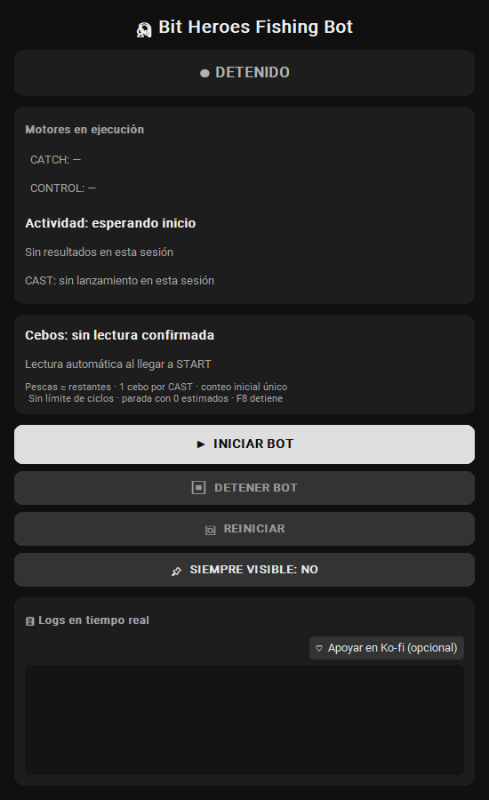

# 🎣 Bit Heroes Fishing Bot

Automatización de la pesca de Bit Heroes para **Windows**, con un panel oscuro,
dos motores separados y parada de emergencia con **F8**.

<!-- PROJECT_LINKS_START -->

<!-- PROJECT_LINKS_END -->

> **Proyecto no oficial.** La automatización puede incumplir las reglas del
> juego y causar restricciones o sanciones a tu cuenta. Revisa sus condiciones
> antes de usarlo. No garantiza capturas exitosas ni CAST máximo en cada intento.

## Qué hace

- **CONTROL** gestiona inventario, START, CAST, resultados y modales.
- **CATCH** decide y envía el clic del minijuego; CONTROL no lo sustituye.
- Lee los cebos **una vez al inicio de cada sesión** y muestra los restantes
  **estimados**: inventario inicial menos un cebo por CAST enviado.
- Confirma el cierre del último resultado antes de detenerse con cero estimados.
- Distingue CAST enviado de valor retenido, CATCH exitosos de recompensas
  directas y resultados FAILED de cierres completos.
- Ofrece **Siempre visible** y una vista compacta comprobada para no tapar
  el inventario ni las barras en la disposición compatible.

No compra cebos, no cambia equipo ni selecciona rarezas automáticamente.
F8, DETENER y cerrar el panel detienen la sesión; no la reinician solos.

## Requisitos

| Componente | Configuración de referencia |
| --- | --- |
| Sistema | Windows, Python de 64 bits |
| Python | **3.13**, con Tcl/Tk y Python Launcher |
| Pantalla principal | **1920 × 1080** |
| Navegador del juego | **Google Chrome** |
| Juego | Bit Heroes en Kongregate, en la pantalla de pesca con START visible |
| Disposición | Interfaz y escala compatibles con las coordenadas comprobadas |

El enfoque automático identifica exactamente la ventana
`Play Bit Heroes Online | Kongregate - Google Chrome`. Usar Brave para el juego,
otro título, otro idioma, zoom, escalado o disposición puede impedir el inicio
o la detección. No se certifica compatibilidad con otras resoluciones.

## Descarga

En [**Releases**](https://github.com/Crzff/BitHeroesFishing/releases), abre la última versión beta y descarga
`BitHeroesFishing-v0.1.0-beta.1-source.zip` de **Assets**.

**Esta descarga contiene código Python, no un .exe portable.** Python y una
conexión a Internet son necesarios para la primera instalación de dependencias.
No ejecutes el programa directamente dentro del ZIP.

## Instalación rápida

1. Instala [Python 3.13 de 64 bits](https://www.python.org/downloads/windows/).
   Incluye **Tcl/Tk**, **pip** y **Python Launcher**; activa *Add Python to PATH*.
2. Descomprime el ZIP en una carpeta donde puedas escribir, por ejemplo
   Documentos. No uses `Program Files` ni reemplaces una instalación en ejecución.
3. Haz doble clic en **`INSTALAR.bat`**. Crea `.venv` dentro de esa carpeta e
   instala las dependencias desde PyPI. **No necesita administrador.**
4. Ejecuta **`COMPROBAR.bat`** para revisar Python, dependencias, plantillas y
   resolución. Esta comprobación no inicia pesca ni envía clics.
5. Abre el juego en Chrome, ve a FISHING y deja **START** visible.
6. Haz doble clic en **`ABRIR_BOT.bat`** y pulsa **INICIAR BOT** en el panel.
7. Para detener: **F8**, **DETENER BOT** o cierra el panel.

Abrir el panel **no inicia la pesca**. No uses el ratón ni cambies la ventana,
la escala o los cebos durante una sesión. Supervisa los primeros intentos y
detén el bot si la pantalla no coincide con la configuración compatible.

Guía completa: [instalación](docs/INSTALACION.md) ·
[funcionamiento](docs/FUNCIONAMIENTO.md) · [problemas frecuentes](docs/FAQ.md).

## Limitaciones

- **Beta**, no una garantía de funcionamiento universal ni de ausencia de sanciones.
- CAST intenta alcanzar el máximo leído de la caña, pero **no siempre lo alcanza**.
- Los restantes son un presupuesto estimado, **no un recuento final de inventario**.
- Una lectura ambigua no se trata como cero.
- No se certifican inventarios con desplazamiento ni cambio automático de rareza.
- Un input enviado por el programa no demuestra recepción por parte del juego.
- El modo normal no es una supervisión externa que revise cada FAILED antes
  del próximo START; puedes detenerlo con F8 para revisar cualquier fallo.

Los resultados de pruebas anteriores son evidencia limitada a esas condiciones,
no una promesa para otras cuentas o sesiones. Más detalles en
[validación](docs/VALIDACION.md).

## Errores y sugerencias

Usa [**Issues**](https://github.com/Crzff/BitHeroesFishing/issues/new/choose) y la plantilla correspondiente. Indica versión,
Python, resolución, zoom y pasos para reproducir el problema. **No publiques
contraseñas, tokens, datos de pago, nombres de cuenta ni capturas completas del PC.**

Consulta [CONTRIBUTING.md](CONTRIBUTING.md) antes de adjuntar registros.

## Apoyar el proyecto

<!-- SUPPORT_START -->

Si te resulta útil, puedes apoyar a **Fmani** para dedicar tiempo a pruebas,
documentación y mejoras. Es voluntario: no desbloquea precisión garantizada,
ventajas dentro del juego ni es requisito para usar el bot. El botón del panel
abre el mismo perfil externo solamente cuando lo pulsas, con pesca detenida.
<!-- SUPPORT_END -->

## Licencia y atribución

El código propio se publica bajo [MIT](LICENSE). Las marcas, fuentes y gráficos
del juego siguen perteneciendo a sus respectivos titulares y **no se relicencian
bajo MIT**. Las referencias visuales de `assets/` son plantillas de reconocimiento,
no una copia del cliente del juego. Revisa [THIRD_PARTY_NOTICES.md](THIRD_PARTY_NOTICES.md).

Este proyecto no está afiliado ni avalado por los propietarios de Bit Heroes,
Kongregate o Google.
